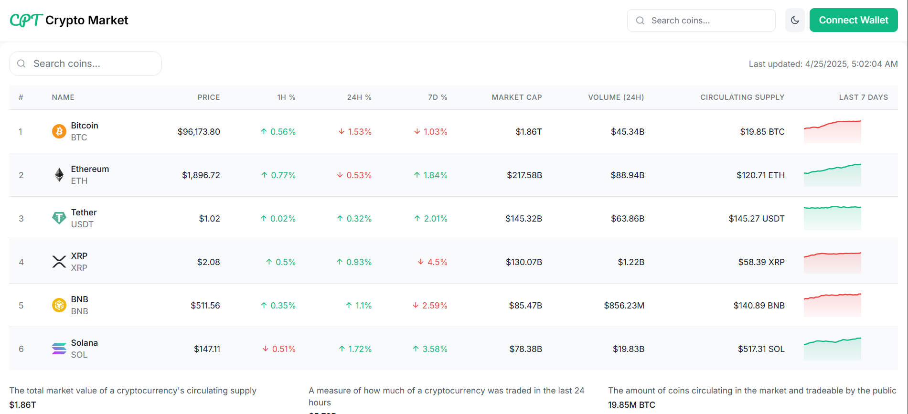

# Crypto Market Tracker 🚀



A responsive React + Redux application that tracks real-time cryptocurrency prices with simulated WebSocket updates, featuring interactive charts and comprehensive market data.

## Features ✨

- **Real-time Price Updates**: Simulated WebSocket updates every 1.5 seconds
- **Interactive Sparkline Charts**: Visualize 7-day price trends for each cryptocurrency
- **Comprehensive Market Data**: 
  - Current prices with 24h change percentages
  - Market capitalization
  - Trading volume
  - Circulating supply
- **Responsive Design**: Works on all device sizes
- **Performance Optimized**: Memoized components for smooth rendering
- **Dark Mode Ready**: Includes dark mode support (toggle in header)

## Technologies Used 🛠️

- **Frontend**: 
  - React 18
  - Redux Toolkit (State management)
  - Tailwind CSS (Styling)
  - ECharts (Data visualization)
- **Build Tools**:
  - Vite (Fast development build)
  - ESLint + Prettier (Code quality)

## Installation 💻

1. Clone the repository:
```bash
git clone https://github.com/yourusername/crypto-tracker.git
cd crypto-tracker
